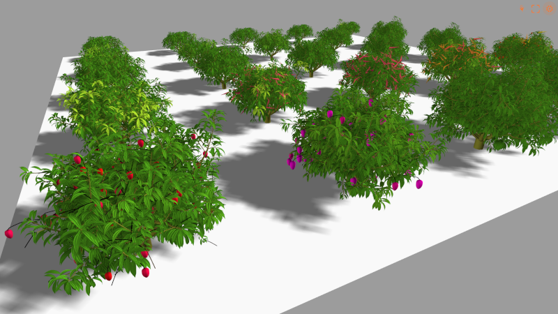
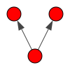

# vmango-lab

[](https://mybinder.org/v2/gh/jvail/vmango-lab/main?filepath=notebooks/vmango.ipynb)

vmango-lab is a library and an environment for the simulation and analysis of mango tree growth, development, fruit production and architecture. vmango-lab is a reimplementation and extension of the V-Mango<sup>[1](#Boudon_2020)</sup> model in pure Python that allows both inspection, drafting, execution and visualization of models composed of processes within Jupyter notebooks.



vmango-lab (vmlab) is built with xarray-simlab (xsimlab v0.5.0, https://xarray-simlab.readthedocs.io/en/latest/), an extension of xarray. Therefore most parts of the documentation provided by xsimlab applies also to vmlab  - except some difference highlighted below:

Due to specific requirements of vmlab the library reimplements some top-level functions of xsimlab. All related to the creation and execution of a model. Therefore the user must use the `vmlab.create_setup` and `vmlab.run` functions (see doc strings) provided by the library rather than using those with identical names implemented in xsimlab.
The parallelization (both single and multi-model processing) provided by xsimlab can not be used within vmlab. vmlab implements its own multi-processing parallelization that is accessible via the vmlab.run function.

### Other top-level functions

`vmlab.get_vars_from_model(model, process_filter)`

Builds an output_vars style dictionary if one wants to export all variables of a process.

`vmlab.check_graph(graph)`

Takes an igraph object and tests if it is valid to be used as an input tree for vmlab.

`vmlab.to_graph(dataframe)`

Takes a pandas DataFrame and builds and returns an igraph object.

`vmlab.to_dataframe(graph)`

Takes an igraph object and builds and returns a pandas DataFrame.

## Examples

There are plenty of examples covering many use cases of vmlab available in the notebooks folder. Additionally there is a cookbook section, code snippet library with code to exemplify the usage of some more developer related features like subclassing, working with igraph trees, persistence and plotting. A minimal example below:

```python
import vmlab
from vmlab.models import vmango

setup = vmlab.create_setup(
    model=vmango,
    start_date='2003-06-01',
    end_date='2004-06-01',
    setup_toml='vmango.toml',
    input_vars={
        'geometry__interpretation_freq': 7
    },
    output_vars={
        'harvest__nb_fruit_harvested': None
    }
)

ds = vmlab.run(setup, vmango)

```

## Model input

Model input is structured into
- a top-level toml file that defines inputs for each process (examples in `vmlab/data/setup`)
- a toml file for each process (quasi constant parameters and other input files like weather data (examples in `vmlab/data/parameters`)
- values directly provided via the `input_vars` dictionary passed to the `vmlab.create_setup` function (`in` or `inout` variables in a process)
- An inital tree (topology) either passed directly into the `vmlab.create_setup` function as a pandas DataFrame or referenced as a csv file within the main toml file. Simple example of an inital tree:

```python
dataframe = pandas.read_csv(
io.StringIO("""
id,parent_id,topology__is_apical
0,NA,1
1,0,1
2,0,0
"""))
graph = vmlab.to_graph(dataframe)
layout = graph.layout_reingold_tilford()
layout.rotate(180)
igraph.plot(graph, layout=layout, bbox=(100, 100))
```



## Useful resources for important dependencies of vmlab

- xsimlab (v0.5.0): https://xarray-simlab.readthedocs.io/en/latest/
- xarray: http://xarray.pydata.org/en/stable/index.html
- igraph: https://igraph.org/python/
- scipy.sparse.csgraph: https://docs.scipy.org/doc/scipy/reference/sparse.csgraph.html#module-scipy.sparse.csgraph

## Installation

### For users with some Python and conda experience

Clone repository and create and activate the conda environment:

```bash
conda env create -f environment.yml
conda activate vmango-lab
```

Install with pip (dev mode):

```bash
pip install -e .
```

### From absolute zero to vmango-lab (windows 10)

#### Download

- miniconda https://docs.conda.io/en/latest/miniconda.html
- git https://git-scm.com/download/win
- vscode https://code.visualstudio.com/download

You may also install TortoiseGit to have simpler access to git from your file explorer:

- TortoiseGit https://tortoisegit.org/download/


#### Install

Run all installers (if you are unsure just use the default options)
Open vscode and open the default terminal available in vscode
run the following commands from the terminal one after the other. The line conda install -c conda-forge nodejs is only required if Node.js is not installed on the system and you want to build the JupyterLab plugin of plantgl-jupyter (3D visualization). This step is not required for classical notebooks.

```bash
git clone https://github.com/fredboudon/vmango-lab.git
cd vmango-lab
conda env create -f environment.yml
conda activate vmango-lab
conda install -c conda-forge nodejs
pip install -e .
```

#### Run Jupyter

If all goes well you can run Jupyter from the vscode terminal (with the vmango-lab conda environment being active)

```bash
jupyter lab
# or
jupyter notebook
```

You will find several notebook examples in the vmango-lab/notebooks


You will find several notebook examples in the vmango-lab/notebooks

You can run directly notebooks from vscode. For this you need to install Jupyter and Python extension, then in the View menu, select 'Command Palette', Type 'Jupyter: Select Interpreter to start Jupyter server', select vmango-lab and then open the notebooks.
To use vmango-lab env in the python shell, you can also type in the command palette, 'Python: Select interpreter' and select the appropriate environment.


---
<a name="Boudon_2020">1</a> Frédéric Boudon et al. V-Mango: a functional–structural model of mango tree growth, development and fruit production, Annals of Botany, Volume 126, Issue 4, 14 September 2020, Pages 745–763
